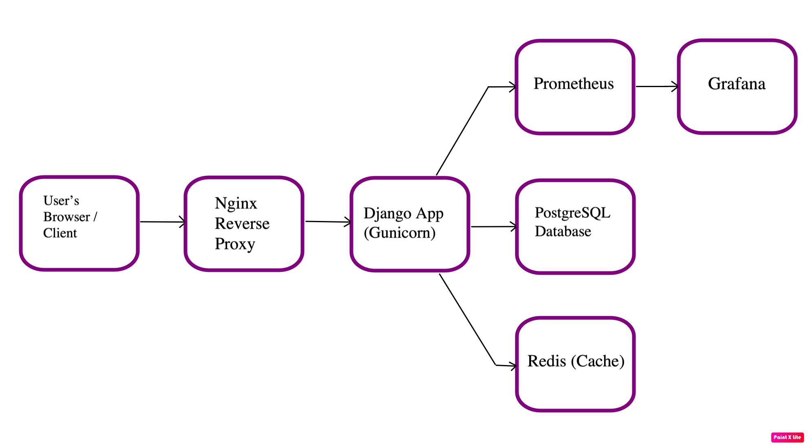

# Foodie

**Foodie** is a production-like Django web application stack simulating a recipe sharing and analytics environment. It demonstrates the use of modern DevOps practices, containerization, observability, and a clear development-to-production workflow.

## Overview

Foodie is a portfolio project designed to showcase:

- **Django (Gunicorn)** as the web framework.
- **PostgreSQL** as the relational database.
- **Redis** as an in-memory cache layer.
- **Nginx** as a reverse proxy and static file server.
- **Prometheus & Grafana** for metrics, monitoring, and observability.
- **Docker & Docker Compose** for containerization.
- A structure ready for **Kubernetes** and production best practices (environment variables, health checks, separate dev/production settings).
- **CI/CD** pipeline integrations with code quality checks (Black, Flake8) and testing.

## Architecture Diagram



The flow is:
- Client (Browser) → Nginx → Django (Gunicorn) → PostgreSQL (DB) + Redis (Cache)
- Prometheus scrapes metrics from the web application, which Grafana visualizes.

## Features

- **Health Endpoint:** `/health/` for application health checks.
- **Prometheus Metrics:** `/metrics/` endpoint for application-level metrics (via `django-prometheus`).
- **CI Pipeline:** GitHub Actions workflow to run linting (Black, Flake8) and tests on every commit.
- **Environment-Specific Settings:** Separate `development.py` and `production.py` settings files for flexible deployment.
- **Observability:** Prometheus and Grafana included to monitor requests, latency, and other application metrics.
- **Static & Media Handling:** Nginx serves static files, emulating a production setup.
- **Security & Hardening (in production):** SSL termination, security headers, and environment-based secrets management outlined for future setup.

## Getting Started

### Prerequisites

- [Docker](https://www.docker.com/) and [Docker Compose](https://docs.docker.com/compose/install/)
- A terminal environment

### Running in Development Mode

1. **Clone the Repo:**
   ```bash
   git clone https://github.com/yourusername/foodie.git
   cd foodie

2. **Understand the Architecture:**
   The 'NOTES.md' file explains in detail on the Architecture of this project

3. **Commands Used:**
   The 'COMMANDS.md'file elaborates all the commands that are required for 'Docker' and 'Django'. Helpful for people who want to learn.